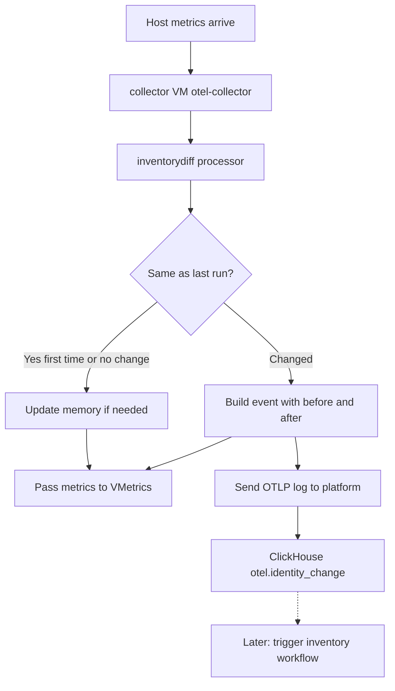

# Scenario 1 — Inventory Diff Processor

## Goal

We want to notice when inventory-related metrics change on a host, record what changed (before and after), and use that to start a targeted inventory update later.

**This plan is only Scenario 1:**

- Write a new OTEL **metrics processor** called `inventorydiff`
- It runs inside **collector VM otel-collector**
- It takes metrics as input
- It compares them to the **previous run** (saved in memory)
- If something changed, it builds an **event**
- It sends that event as an OTLP **log** to the platform otel path
- Platform stores the event in ClickHouse
- Later (not in this code slice), platform can trigger the inventory update workflow from that event

We do **not** re-diff on the platform. The event we send is the final change record.

---

##  workflow




---

## What changes we look for

For each watched metric name, we keep the full set of series (labels + value).


| Change type         | Meaning                                                                   |
| ------------------- | ------------------------------------------------------------------------- |
| **Label change**    | Old label set gone, new label set appears (same idea as replace)          |
| **Value change**    | Same labels, number changed                                               |
| **Metric addition** | New series appears (new labels), or metric had no series and now has some |
| **Metric removal**  | Series disappeared, or metric went from some series to none               |


Any of these = “snapshot changed” → emit one event with full **before** and **after** snapshots.

---

## Examples: PrechangeData and PostchangeData (4 scenarios)

Metric used below (unless noted): `node_md_member_state` on host `host-a`.

### 1) Metric removal (series removed)

Disk `sdb` left the array. That series is gone.

**PrechangeData:**

```json
{
  "series": [
    {"labels": {"array": "md0", "device": "sda", "state": "in_sync"}, "value": 1},
    {"labels": {"array": "md0", "device": "sdb", "state": "in_sync"}, "value": 1}
  ]
}
```

**PostchangeData:**

```json
{
  "series": [
    {"labels": {"array": "md0", "device": "sda", "state": "in_sync"}, "value": 1}
  ]
}
```

`action`: `update` (metric still has series). If **all** series are gone → `action`: `delete` and PostchangeData is `{"series":[]}`.

### 2) Metric added (series added)

New disk `sdc` joined the array.

**PrechangeData:**

```json
{
  "series": [
    {"labels": {"array": "md0", "device": "sda", "state": "in_sync"}, "value": 1}
  ]
}
```

**PostchangeData:**

```json
{
  "series": [
    {"labels": {"array": "md0", "device": "sda", "state": "in_sync"}, "value": 1},
    {"labels": {"array": "md0", "device": "sdc", "state": "spare"}, "value": 1}
  ]
}
```

`action`: `update`. If metric went from empty `{"series":[]}` to having series → `action`: `create`.

### 3) Update label

Same device `sda`, but label `state` changed from `in_sync` to `faulty`.  
In metrics this usually means: old series key removed + new series key added.

**PrechangeData:**

```json
{
  "series": [
    {"labels": {"array": "md0", "device": "sda", "state": "in_sync"}, "value": 1},
    {"labels": {"array": "md0", "device": "sdb", "state": "in_sync"}, "value": 1}
  ]
}
```

**PostchangeData:**

```json
{
  "series": [
    {"labels": {"array": "md0", "device": "sda", "state": "faulty"}, "value": 1},
    {"labels": {"array": "md0", "device": "sdb", "state": "in_sync"}, "value": 1}
  ]
}
```

`action`: `update`.

### 4) Update value

Same labels, only the number changed (example metric: `node_bonding_active`).

**PrechangeData:**

```json
{
  "series": [
    {"labels": {"master": "bond0"}, "value": 2}
  ]
}
```

**PostchangeData:**

```json
{
  "series": [
    {"labels": {"master": "bond0"}, "value": 1}
  ]
}
```

`action`: `update`.

---

## Config (simple)

Only a list of metric names to watch:

```yaml
processors:
  inventorydiff:
    metrics:
      - node_md_member_state
      - hwraid_vd_state
    changelog:
      endpoint: https://nxtgen.asama.cloud:8444/api/otel
      headers:
        Authorization: "Basic ..."

service:
  pipelines:
    metrics:
      receivers: [otlp]
      processors: [inventorydiff, batch]
      exporters: [prometheusremotewrite]
```

---

## Files to create / change

All new processor code under:

`opentelemetry-collector-contrib/processor/inventorydiff/`

Also edit:

`opentelemetry-collector-contrib/cmd/otel-collector/builder-config.yaml`

---

### 1. NEW `processor/inventorydiff/doc.go`

```go
// Package inventorydiff compares watched metrics to the last in-memory
// snapshot and emits a changelog log event when they differ.
package inventorydiff
```

---

### 2. NEW `processor/inventorydiff/config.go`

```go
package inventorydiff

import (
	"errors"
	"time"
)

type ChangelogExport struct {
	Endpoint string            `mapstructure:"endpoint"`
	Headers  map[string]string `mapstructure:"headers"`
	Timeout  time.Duration     `mapstructure:"timeout"`
}

type Config struct {
	Metrics   []string        `mapstructure:"metrics"`
	Changelog ChangelogExport `mapstructure:"changelog"`
}

func createDefaultConfig() component.Config {
	return &Config{
		Changelog: ChangelogExport{Timeout: 10 * time.Second},
	}
}

func (c *Config) Validate() error {
	if len(c.Metrics) == 0 {
		return errors.New("metrics list must not be empty")
	}
	if c.Changelog.Endpoint == "" {
		return errors.New("changelog.endpoint is required")
	}
	return nil
}
```

---

### 3. NEW `processor/inventorydiff/factory.go`

```go
package inventorydiff

import (
	"context"

	"go.opentelemetry.io/collector/component"
	"go.opentelemetry.io/collector/consumer"
	"go.opentelemetry.io/collector/processor"
	"go.opentelemetry.io/collector/processor/processorhelper"
)

const typeStr = "inventorydiff"

func NewFactory() processor.Factory {
	return processor.NewFactory(
		component.MustNewType(typeStr),
		createDefaultConfig,
		processor.WithMetrics(createMetricsProcessor, component.StabilityLevelDevelopment),
	)
}

func createMetricsProcessor(
	ctx context.Context,
	set processor.Settings,
	cfg component.Config,
	next consumer.Metrics,
) (processor.Metrics, error) {
	oCfg := cfg.(*Config)
	if err := oCfg.Validate(); err != nil {
		return nil, err
	}
	p := newProcessor(set.Logger, oCfg)
	return processorhelper.NewMetrics(
		ctx, set, cfg, next, p.processMetrics,
		processorhelper.WithCapabilities(consumer.Capabilities{MutatesData: false}),
		processorhelper.WithStart(p.start),
		processorhelper.WithShutdown(p.shutdown),
	)
}
```

---

### 4. NEW `processor/inventorydiff/snapshot.go`

Builds the “picture” of one metric for one host.

```go
package inventorydiff

import (
	"encoding/json"
	"sort"
	"strings"

	"go.opentelemetry.io/collector/pdata/pmetric"
)

// SeriesPoint is one time series under a metric.
type SeriesPoint struct {
	Labels map[string]string `json:"labels"`
	Value  float64           `json:"value"`
}

// MetricSnapshot is all series for one metric on one host.
type MetricSnapshot struct {
	Series []SeriesPoint `json:"series"`
}

func (s MetricSnapshot) KeySet() map[string]float64 {
	out := make(map[string]float64, len(s.Series))
	for _, sp := range s.Series {
		out[seriesKey(sp.Labels)] = sp.Value
	}
	return out
}

func seriesKey(labels map[string]string) string {
	keys := make([]string, 0, len(labels))
	for k := range labels {
		keys = append(keys, k)
	}
	sort.Strings(keys)
	parts := make([]string, 0, len(keys))
	for _, k := range keys {
		parts = append(parts, k+"="+labels[k])
	}
	return strings.Join(parts, ",")
}

func equalSnapshot(a, b MetricSnapshot) bool {
	ak, bk := a.KeySet(), b.KeySet()
	if len(ak) != len(bk) {
		return false
	}
	for k, v := range ak {
		if bv, ok := bk[k]; !ok || bv != v {
			return false
		}
	}
	return true
}

func snapshotToJSON(s MetricSnapshot) string {
	b, _ := json.Marshal(s)
	return string(b)
}

// snapshotFromMetrics reads one metric name for one hostname from the batch.
func snapshotFromMetrics(md pmetric.Metrics, hostname, metricName string) MetricSnapshot {
	// walk ResourceMetrics / ScopeMetrics / Metrics / datapoints
	// keep only matching hostname + metricName
	// append SeriesPoint{Labels, Value}
	return MetricSnapshot{}
}
```

**Example of what a snapshot looks like:**

```json
{
  "series": [
    {"labels": {"array": "md0", "device": "sda", "state": "in_sync"}, "value": 1},
    {"labels": {"array": "md0", "device": "sdb", "state": "in_sync"}, "value": 1}
  ]
}
```

---

### 5. NEW `processor/inventorydiff/state.go` — in-memory cache (pre-state)

This is where we store the **previous run**.

```go
package inventorydiff

import "sync"

// stateStore holds last known snapshot per host + metric.
// Example key: "host-a\x00node_md_member_state"
type stateStore struct {
	mu sync.Mutex
	m  map[string]MetricSnapshot
}

func newStateStore() *stateStore {
	return &stateStore{m: make(map[string]MetricSnapshot)}
}

func stateKey(hostname, metric string) string {
	return hostname + "\x00" + metric
}

func (s *stateStore) Get(hostname, metric string) (MetricSnapshot, bool) {
	s.mu.Lock()
	defer s.mu.Unlock()
	v, ok := s.m[stateKey(hostname, metric)]
	return v, ok
}

func (s *stateStore) Set(hostname, metric string, snap MetricSnapshot) {
	s.mu.Lock()
	defer s.mu.Unlock()
	s.m[stateKey(hostname, metric)] = snap
}
```

**Example memory after first run for host-a:**

```text
map[
  "host-a\x00node_md_member_state" = MetricSnapshot{
    Series: [
      {Labels: {array:md0, device:sda, state:in_sync}, Value: 1},
      {Labels: {array:md0, device:sdb, state:in_sync}, Value: 1},
    ]
  }
]
```

- First time we see a key → **save only**, no event  
- Next time different → event, then overwrite with new snapshot  
- Collector restart → map empty → seed again (no fake events)

---

### 6. NEW `processor/inventorydiff/processor.go` — main logic + event

```go
package inventorydiff

import (
	"context"
	"time"

	"github.com/google/uuid"
	"go.opentelemetry.io/collector/pdata/pmetric"
	"go.uber.org/zap"
)

type inventoryDiffProcessor struct {
	logger *zap.Logger
	cfg    *Config
	state  *stateStore
	// changelog client created in start()
}

func newProcessor(logger *zap.Logger, cfg *Config) *inventoryDiffProcessor {
	return &inventoryDiffProcessor{
		logger: logger,
		cfg:    cfg,
		state:  newStateStore(),
	}
}

// processMetrics is called for every metrics batch.
// INPUT:  md = current metrics from hosts
// OUTPUT: same md (unchanged) so VMetrics path keeps working
func (p *inventoryDiffProcessor) processMetrics(ctx context.Context, md pmetric.Metrics) (pmetric.Metrics, error) {
	// for each hostname in md:
	//   for each metric name in p.cfg.Metrics:
	//     current := snapshotFromMetrics(md, hostname, metric)
	//     prev, ok := p.state.Get(hostname, metric)
	//     if !ok {
	//       p.state.Set(hostname, metric, current) // first run: cache only
	//       continue
	//     }
	//     if equalSnapshot(prev, current) {
	//       continue // no change
	//     }
	//     // CHANGE: label / value / add / remove all show up as snapshot !=
	//     _ = p.emitChangelog(ctx, hostname, metric, prev, current)
	//     p.state.Set(hostname, metric, current)
	return md, nil
}

// emitChangelog turns the diff into an event and sends it as an OTLP log.
func (p *inventoryDiffProcessor) emitChangelog(
	ctx context.Context,
	hostname, metric string,
	pre, post MetricSnapshot,
) error {
	requestID := uuid.NewString()
	action := "update"
	if len(pre.Series) > 0 && len(post.Series) == 0 {
		action = "delete"
	} else if len(pre.Series) == 0 && len(post.Series) > 0 {
		action = "create"
	}

	// Build OTLP log:
	//   resource: service.name=asama-inventory-changelog, hostname=...
	//   body: "metric identity changed"
	//   attributes:
	//     request_id, action, hostname, metric
	//     prechange_data  = snapshotToJSON(pre)
	//     postchange_data = snapshotToJSON(post)
	// POST to p.cfg.Changelog.Endpoint
	_ = requestID
	_ = action
	_ = time.Now()
	return nil
}
```

#### How the event looks (what we send)

```json
{
  "resource": {
    "service.name": "asama-inventory-changelog",
    "hostname": "host-a"
  },
  "body": "metric identity changed",
  "attributes": {
    "request_id": "c1a2b3c4-1111-2222-3333-444444444444",
    "action": "update",
    "hostname": "host-a",
    "metric": "node_md_member_state",
    "prechange_data": "{\"series\":[{\"labels\":{\"array\":\"md0\",\"device\":\"sda\",\"state\":\"in_sync\"},\"value\":1}]}",
    "postchange_data": "{\"series\":[{\"labels\":{\"array\":\"md0\",\"device\":\"sda\",\"state\":\"faulty\"},\"value\":1}]}"
  }
}
```

`**request_id`:** new UUID made in `emitChangelog` for this one event. Used later to find the same row in ClickHouse / workflow.

**Where event is built:** `emitChangelog`  
**Where event is decided:** `processMetrics` when `equalSnapshot` is false

---

### 7. NEW `processor/inventorydiff/processor_test.go`

Tests:

1. First batch → memory filled, no event
2. Same data again → no event
3. Value change → event
4. Label change → event
5. Series added → event
6. Series removed → event
7. If changelog send fails → metrics still returned (no break VMetrics)

---

### 8. NEW `processor/inventorydiff/go.mod` + `README.md`

Module + short how-to for collector VM config.

---

### 9. EDIT `cmd/otel-collector/builder-config.yaml`

Add to processors:

```yaml
- gomod: github.com/open-telemetry/opentelemetry-collector-contrib/processor/inventorydiff v0.141.0
```

Add to replaces:

```yaml
- github.com/open-telemetry/opentelemetry-collector-contrib/processor/inventorydiff => ../../processor/inventorydiff
```

Rebuild collector VM image / binary after this.

---

## ClickHouse storage

**Table name:** `otel.identity_change`  
**One event = one row**  
Platform only stamps tenant and inserts. No second diff.


| Column               | Type          | What it holds                                 |
| -------------------- | ------------- | --------------------------------------------- |
| `Timestamp`          | DateTime64(9) | when the change was seen                      |
| `Tenant`             | String        | tenant id                                     |
| `Hostname`           | String        | host name                                     |
| `ServiceName`        | String        | `asama-inventory-changelog`                   |
| `Metric`             | String        | metric name we watched                        |
| `Action`             | String        | `update` / `create` / `delete`                |
| `RequestId`          | String        | UUID from `emitChangelog`                     |
| `**PrechangeData**`  | **String**    | JSON of **before** snapshot                   |
| `**PostchangeData**` | **String**    | JSON of **after** snapshot                    |
| `Body`               | String        | short text                                    |
| `ResourceAttributes` | Map           | standard OTEL fields                          |
| `LogAttributes`      | Map           | raw attrs from the log (exporter wire format) |


Before/after for the product are columns `**PrechangeData**` and `**PostchangeData**`.

Example read:

```sql
SELECT Timestamp, Hostname, Metric, Action, RequestId, PrechangeData, PostchangeData
FROM otel.identity_change
WHERE Hostname = 'host-a'
ORDER BY Timestamp DESC
LIMIT 10
```

Platform follow-up (config, not re-processing): route logs with `service.name = asama-inventory-changelog` into this table. From there, later trigger inventory update workflow (Subtask 3).

---

## What this slice does / does not do

**Does**

- Diff on collector VM otel
- Memory cache of last snapshot
- Event with before/after
- Send event toward platform / ClickHouse table design

**Does not**

- Change host-agent
- Call CISS from collector VM
- Run inventory sync itself (that is the later workflow)

---

## How to check it works

1. Unit tests for the four change types
2. Build collector with `inventorydiff` in builder-config
3. Send two metric batches (old then new) → one event with pre/post
4. Confirm metrics still go to VMetrics
5. With platform table wired → one row in `otel.identity_change`

